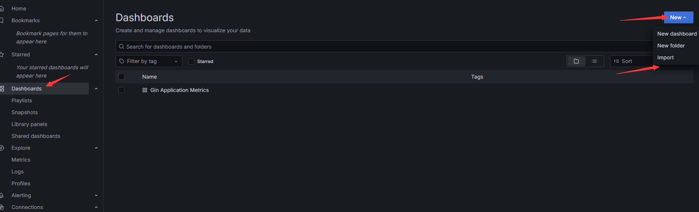
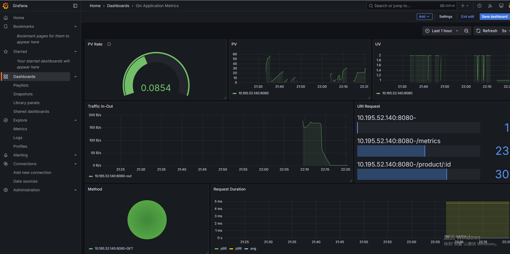

# 项目介绍

> **开发背景**

`gin-monitor` 是一个针对 **Gin Web 框架** 设计的 **Prometheus 监控中间件**，它能够 **无缝集成** Prometheus，开箱即用地收集并暴露应用的性能指标，帮助开发者高效监控应用运行状况。

> **开发意义**

| **优点**             | **描述**                                                     |
| -------------------- | ------------------------------------------------------------ |
| **开箱即用**         | 仅需引入 `gin-monitor` 并调用 `.Use(r)`，即可自动收集指标，无需额外配置。 |
| **自动收集关键指标** | 采集 **请求总数、响应时间、状态码分**等重要监控数据。        |
| **无侵入式设计**     | 作为 **Gin 中间件** 运行，不影响业务代码，可直接集成到现有项目中。 |
| **兼容 Prometheus**  | 采集的数据符合 **Prometheus** 规范，可直接对接 **Prometheus + Grafana** 进行可视化分析。 |
| **支持路由监控**     | 可针对 **特定 API 路由** 进行监控，避免对非关键路径的额外开销。 |
| **高性能**           | 轻量级中间件，开销极小，适用于 **高并发场景**，不会影响应用性能。 |
| **适用于微服务架构** | 适合 **微服务环境**，多个 Gin 实例可统一上报数据，方便集中监控和分析。 |
| **故障分析**         | 通过 **状态码统计、响应时间分析**，快速定位 API 瓶颈或异常请求，提升排障效率。 |

> **监控指标**

| **Metric 指标**               | **类型 (Type)** | **描述 (Description)**                            | **分析与应用**                                               |
| ----------------------------- | --------------- | ------------------------------------------------- | ------------------------------------------------------------ |
| **`gin_request_total`**       | Counter         | 记录 Gin 服务接收到的 **总请求数**。              | 监控服务的 **请求量**，用于流量趋势分析，异常增长可能表示被攻击。 |
| **`gin_request_uv`**          | Counter         | 记录服务接收到的 **独立 IP 请求数**（UV）。       | 用于分析 **独立访客数**，结合 `gin_request_total` 计算 PV/UV 比例。 |
| **`gin_uri_request_total`**   | Counter         | 记录每个 **URI** 的请求次数。                     | 用于分析 **API 访问热点**，找出最常用的接口，优化热点请求性能。 |
| **`gin_request_body_total`**  | Counter         | 记录服务接收到的 **请求体数据总量**，单位：字节。 | 监控 **请求流量**，可用于发现异常大流量请求，例如上传大文件。 |
| **`gin_response_body_total`** | Counter         | 记录服务返回的 **响应体数据总量**，单位：字节。   | 监控 **下行流量**，可结合请求体流量分析数据传输比率。        |
| **`gin_request_duration`**    | Histogram       | 记录 **每个请求的处理时间**，单位：秒。           | 监控 **API 响应性能**，用于发现 **慢请求**，优化 API 延迟。  |
| **`gin_slow_request_total`**  | Counter         | 记录 **超过阈值的慢请求数**（如 >1s）。           | 监控 **慢查询**，辅助 **性能优化**，找出需要优化的 API。     |

# 项目目录

```yml
G:.
│  docker-compose.yml
│  go.mod
│  go.sum
│  main.go
│  prometheus.yml
│  ReadMe.md
│
├─grafana
│      dashboard.json
│
├─metrics
│      bloom.go
│      bloomfilter_test.go
│      metric.go
│      monitor.go
│
├─note
│      开发文档.md
│
└─ReadMe
```

>  **Note：`prometheus.yml`**

- **`static_configs`**: 这部分定义了静态配置，指定了需要抓取的目标地址。在这里，它使用了`targets`来指定Prometheus抓取的目标服务的地址。
  - **`targets: ['10.195.52.140:8080']`**: 这是一个目标列表，表示Prometheus会抓取IP地址为`10.195.52.140`，端口为`8080`的服务。这个服务应该暴露出Prometheus可以读取的监控数据，例如使用`webserver_exporter`（或类似的exporter）来提供Web服务器的指标。这个IP要根据个人的环境自行更改。
- 扩展：若有多个监控对象，可以按照如下写法进行指标收集。

```yml
scrape_configs:
  - job_name: 'user-service'
    static_configs:
      - targets: ['localhost:8081']
  
  - job_name: 'order-service'
    static_configs:
      - targets: ['localhost:8082']

  - job_name: 'payment-service'
    static_configs:
      - targets: ['localhost:8083']
```

# 运行步骤

运行命令：

```bash
docker-compose up -d
```


Note:要将这两个中间件放在同一个网桥里面，要不然无法通信。

>  **Step1：先添加数据源**

http://localhost:3000/


>  **Step2：导入模板内容**



这样即可通过在grafana中导入数据进行展示了



> **Bug**

Note：如果出现下面的PV的情况，可以尝试如下的方式·


同时也可以通过prometheus：http://localhost:9090/ 对其进行访问


# TODO

- 可以将prometheus和ELK联动

欢迎PR